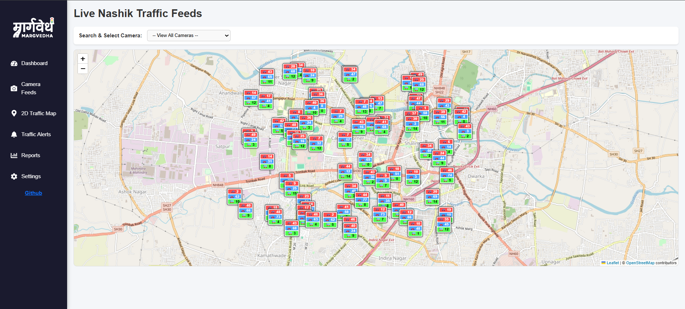

# 🚦 Marg Vedha 3.0 – Real-Time Traffic Optimization System for Urban Congestion  

### 🏆 Smart India Hackathon 2025 (Problem Statement ID: **SIH25050**)  
**Team ID:** 52806 | **Team Name:** Marg Vedha 3.0  

---

## 📌 Problem Statement  
Urban cities in India face **severe traffic congestion**, leading to:  
- Long commute times ⏳  
- Increased CO₂ emissions 🌍  
- Delayed emergency services 🚑  
- Reduced logistics and workforce productivity 📦  

A **smart, AI-driven traffic management solution** is required to optimize urban mobility, reduce congestion, and enable faster emergency response.  

---

## 💡 Proposed Solution  
We built an **AI-powered modular platform** for **real-time traffic optimization**, integrating **computer vision, reinforcement learning, and citizen participation**.  

### 🔑 Key Features  
- **🚗 Lane-wise Vehicle Counting & Incident Detection** using **YOLOv11 + BoT-SORT**  
- **🧠 Agentic AI** dynamically adjusting signal timings in real-time  
- **⏱ 1-Hour Traffic Forecasting** using Reinforcement Learning (Q-Learning + RL models)  
- **🌐 3D Simulation Preview** for planners with **three.js**  
- **📊 Live Dashboard (SUMO)** – Graphs, alerts, and predictive analytics  
- **🚌 Bus Route Optimization** – Adaptive routing based on passenger demand  
- **🚨 Emergency Green Corridors** – Automatic signal clearance for ambulances/fire trucks  
- **📱 Citizen Reports + Targeted Alerts** via mobile/web apps  

---

## 🗺️ Live 2D Traffic Monitoring Map (Nashik)
We have integrated a real-time, interactive **2D Traffic Monitoring Map** powered by Leaflet. This dashboard feature provides a bird's-eye view of traffic density across 80 active camera feeds in the Nashik area.

- **Dynamic Markers:** Custom UI box indicators visualizing live vehicle counts for Cars (🚗), Bikes (🏍️), and Buses (🚌).
- **Camera Selection Dropdown:** Instantly search and fly to any of the 80 camera locations across the city.
- **Live State Updates:** View real-time simulated traffic density and active congestion alerts natively on the map.

---

## 🛠️ Tech Stack  

**Core AI/ML:**  
- **YOLOv11** – Object Detection  
- **BoT-SORT** – Multi-object tracking  
- **Reinforcement Learning (RL + Q-Learning)** – Adaptive signal optimization  
- **TensorFlow / PyTorch** – Model training  

**Simulation & Visualization:**  
- **SUMO** – Traffic simulation & performance testing  
- **Three.js** – 3D visualization of traffic flow  

**Backend & Infrastructure:**  
- **Python** – AI/ML pipeline  
- **Kotlin (Android)** – Mobile app for citizens/authorities  
- **Bhuvan API (ISRO)** – Geospatial data integration  
- **Cloud + Local DB** – For storage & offline resilience  

**Additional Tools:**  
- Hugging Face (AI hosting)  
- GitHub (collaboration & version control)  
- Gradio (ML model interface for testing)  

---

## 📐 System Architecture  

1. **Data Collection** – CCTV feeds, GPS, Bhuvan API, open government data  
2. **AI Pipeline** – YOLOv11 + BoT-SORT for vehicle detection & violation monitoring  
3. **Reinforcement Learning Layer** – Signal timing optimization & traffic forecasting  
4. **Supervisory AI Layer** – Error control + emergency prioritization  
5. **Visualization** – 3D simulations, live dashboards, citizen mobile alerts  

---

## 🚀 Impact & Benefits  

### 👥 Social  
- Reduced commute stress & frustration  
- Faster emergency response 🚑  
- Transparent dashboards → Higher public trust  

### 💰 Economic  
- Lower logistics & fuel costs  
- Productivity boost (reduced travel delays)  
- ROI for municipalities through smart tolling & efficient bus routes  

### 🌱 Environmental  
- Reduced idle time → Lower CO₂ emissions  
- Greener mobility with priority public transport  

---

## 📊 Results  
- **~74% efficiency improvement** in simulations  
- **Emergency response time reduction** via Green Corridors  
- **Scalable, modular design** → Can be deployed city-wide with existing infrastructure  

---

## 📚 References & Research  
- [YOLOv11 Performance in ITS](https://arxiv.org/html/2410.22898v1)  
- [Deep RL for Traffic Signal Control](https://www.ijfmr.com/papers/2024/1/11650.pdf)  
- [Transportation Research Part C: Emerging Technologies](https://www.sciencedirect.com/science/article/pii/S2352146525000687)  
- [Bhuvan API (ISRO)](https://bhuvan-app1.nrsc.gov.in/api/)  
- [Government of India Open Data](https://www.data.gov.in/apis)  

---

## 🌐 Live Links  
- **Website:** [Marg Vedha Portal](https://nocopymarg-vedha.vercel.app/)  
- **Simulation Repo:** [3D Traffic Simulation](https://github.com/Aditya948351/3D-Traffic-Simulation)  
- **Main Repo:** [Marg Vedha GitHub](https://github.com/Aditya948351/MargVedhaMain)  
- **Demo Drive Videos:** [Google Drive](https://drive.google.com/drive/folders/1U1yZOBJTfGuDqCg1dIaAl9V2nXLSeUF4?usp=sharing)  
- **Hugging Face Space:** [Marg Vedha AI](https://huggingface.co/spaces/starkbyte45896/Marg-Vedha)  

---

## 👩‍💻 Team – Marg Vedha 3.0  
- **Aditya** – ML & Android Development  
- **Team Members** – ML, Web Development, Java Programming  

---

## 📌 Future Scope  
- Integration with **5G IoT sensors** for faster response  
- AI-powered **accident prediction** & early warnings  
- **Blockchain-secured ticketing & payments** for public transport  
- Expansion to **multi-city smart grid traffic management**  
